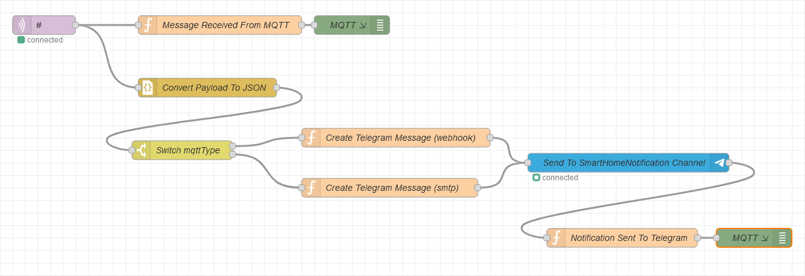
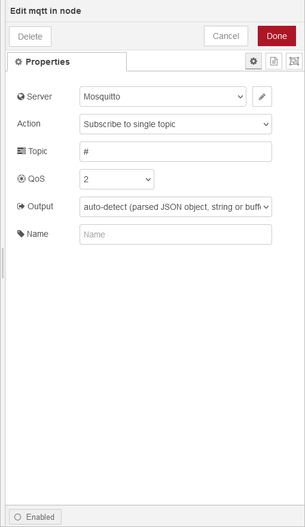
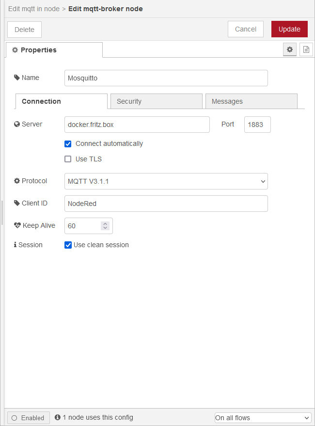
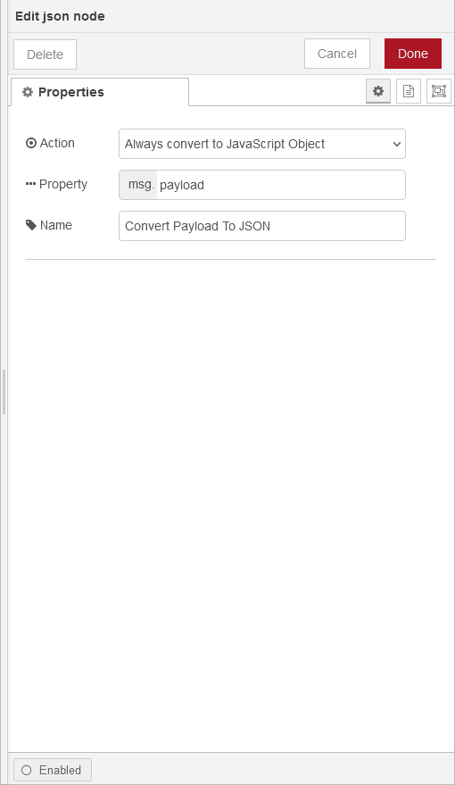
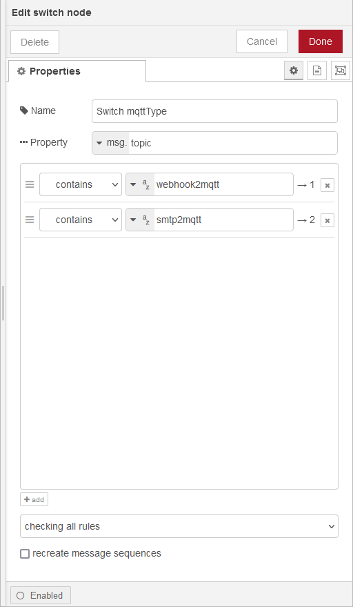
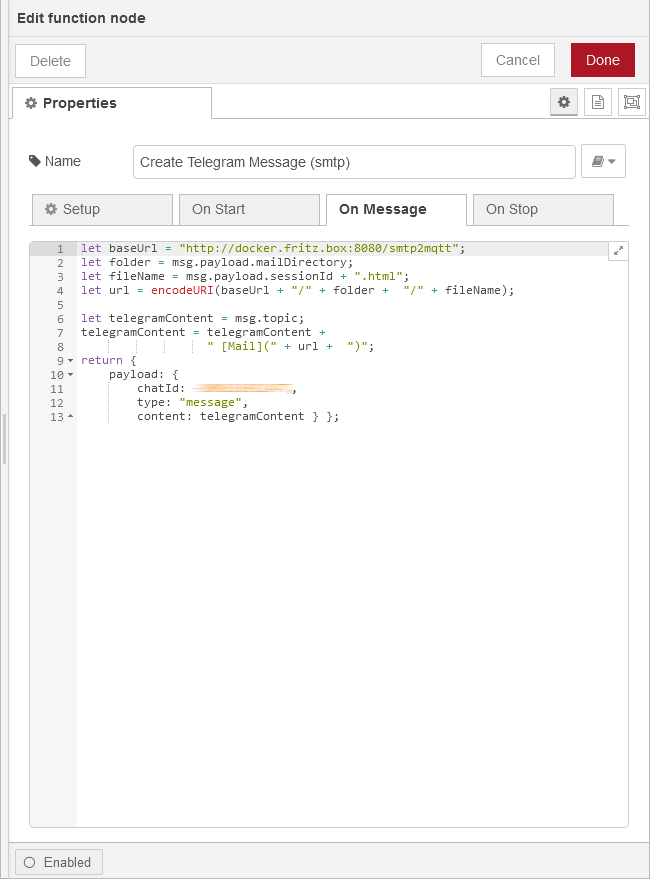
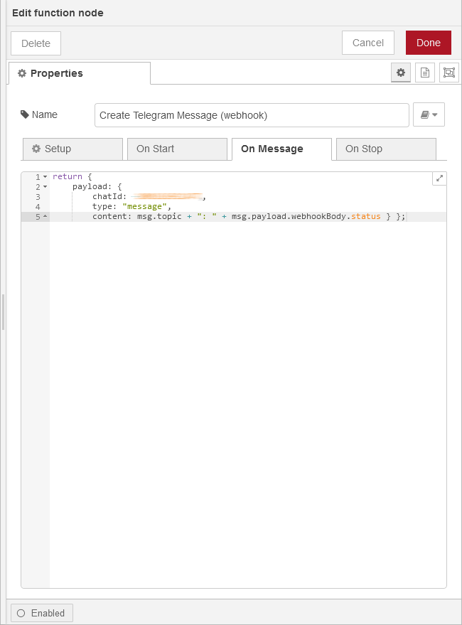
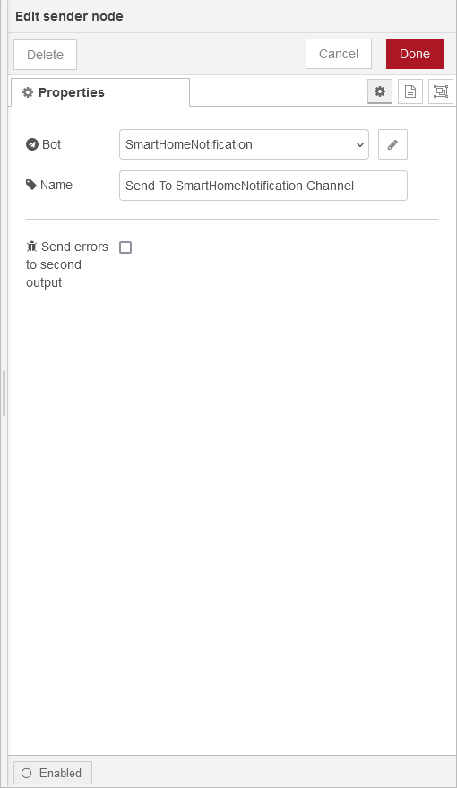
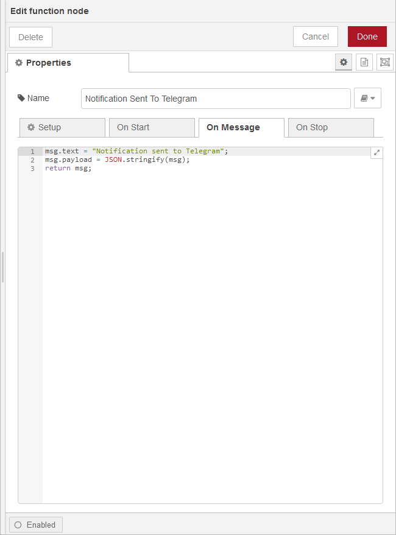
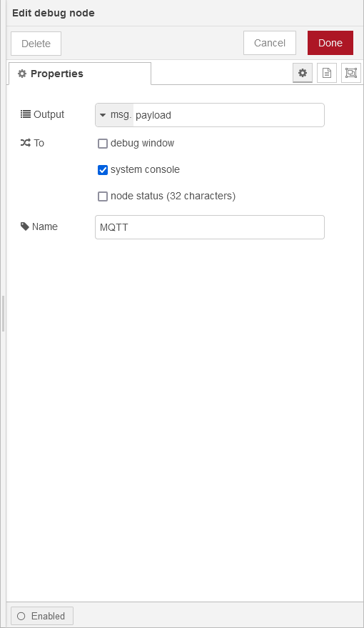

# Workflow for sending MQTT to Telegram

# MQTT node

# MQTT configuration

# Convert MQTT payload from string to Javascript object

# Switch depending on topic

# Create Telegram message for SMTP

# Create Telegram message for WebHook

# Send Telegram message to SmartHomeNotification channel

# Write log message to NodeRed console and therefore to Loki

